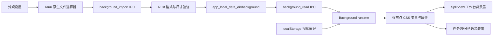
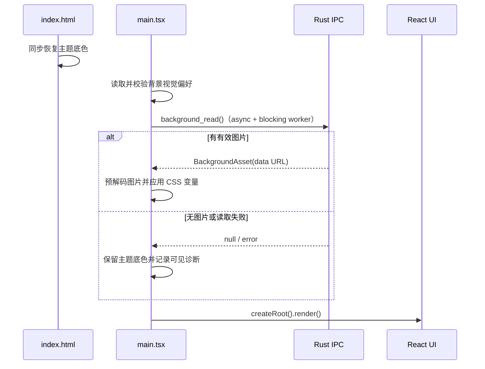

# Desktop 自定义透明背景设计

Feature Name: desktop-custom-background
Updated: 2026-08-20

## Description

Desktop 在工作台底层渲染一张应用管理的本地图片，并让任务列、分格和聊天表面使用可调不透明度的主题色。设置页、菜单、弹窗及其他关键交互表面维持不透明。首版不启用 Tauri 主窗口透明，也不依赖 macOS vibrancy、Windows Mica/Acrylic 或 Linux compositor。

设计采用“图片资产由 Rust 管理、视觉偏好由前端即时管理”的边界：

- Rust 负责文件选择后的格式验证、尺寸限制、原子复制、读取和清理。
- 前端以 localStorage 保存不透明度、模糊度和填充方式，沿用主题设置“修改即生效”的交互。
- 工作台使用显式语义表面类，不全局改写 daisyUI 的 `bg-base-*`，避免弹窗、卡片和设置页意外透明。

## Architecture



### 启动顺序



React 工作台在背景初始化完成后挂载，使有效背景在工作台第一次可见时已经生效；`main.tsx` 使用 Promise continuation 而非顶层 `await`，兼容 macOS 11 的 Safari 14 WKWebView。`index.html` 的现有主题首帧脚本继续作为等待期间的稳定后备底色，不把图片字节写入 localStorage。

## Components and Interfaces

### 1. Rust 背景资产服务

新增 `desktop/src/background.rs`，只处理应用内背景资产，不进入 Agent 引擎配置。

#### Commands

```rust
#[derive(Serialize)]
#[serde(rename_all = "camelCase")]
pub struct BackgroundAsset {
    pub revision: String,
    pub original_name: String,
    pub mime: String,
    pub width: u32,
    pub height: u32,
    pub data_url: String,
}

pub struct StagedBackgroundAsset {
    pub asset: BackgroundAsset,
    pub staged_id: String,
}

#[tauri::command]
pub async fn background_import(app: AppHandle, path: String) -> Result<StagedBackgroundAsset, String>;

#[tauri::command]
pub async fn background_confirm(app: AppHandle, staged_id: String) -> Result<(), String>;

#[tauri::command]
pub async fn background_discard(app: AppHandle, staged_id: String) -> Result<(), String>;

#[tauri::command]
pub async fn background_read(app: AppHandle) -> Result<Option<BackgroundAsset>, String>;

#[tauri::command]
pub async fn background_clear(app: AppHandle) -> Result<(), String>;
```

`background_import` 执行以下步骤：

1. 使用文件元数据拒绝非普通文件和超过 20 MiB 的文件，并通过 `take(MAX_BYTES + 1)` 有界读取，防止校验后的增长文件触发无界分配。
2. 只根据实际字节格式识别 PNG、JPEG、WebP，不信任扩展名或调用方提供的 MIME。
3. 使用 `image` 解码器读取尺寸并拒绝任一边超过 16,384 px、总像素超过 50,000,000 或无法解码的图片；限制解码内存，防止压缩炸弹。
4. 计算 SHA-256 作为 revision，原子写入 `background/assets/<revision>.<ext>`，再写入唯一的 `background/pending/<staged-id>.json`；此时不修改 current。
5. 返回待确认资产的受控 `data:image/...;base64,...` URL，WebView 先预解码。
6. 预解码成功后 `background_confirm` 才原子替换 `background/current.v1.json`；失败或操作过期则 `background_discard` 删除 pending，旧背景继续有效。
7. 所有元数据提交与清理持有跨进程文件锁；清理在锁内重新读取 current/pending 推导保留集，不接受过期 keep。

使用内容散列文件名而不是固定文件名，可保证崩溃发生在确认前时旧元数据仍指向旧图片；确认后的孤儿文件可在下次读取或导入时清理。同步文件 I/O、图片解码与 base64 编码均通过 `tauri::async_runtime::spawn_blocking` 离开 Tauri 主线程。

`background_read` 只读取服务自己生成的版本化元数据，校验文件名为单一 basename、文件位于背景目录内、大小和 MIME 仍符合限制，然后返回 data URL。损坏元数据、路径逃逸、缺失资产和解码失败均返回可外显错误，不读取任意用户路径。

`background_clear` 先原子移除当前元数据，再尽力删除背景资产目录中的托管文件；删除失败不阻止前端立即恢复主题外观。

在 `desktop/src/main.rs` 现有 Tauri builder 上无需新增插件；将五个命令登记到 `generate_handler!`，并在 `build.rs` 与 `desktop/tauri.conf.json` 主窗口 capability 中同步登记。主窗口 builder 保持不透明配置不变。

### 2. 前端 IPC 适配

新增 `desktop/ui-next/src/lib/ipc/background.ts`：

```ts
export interface BackgroundAsset {
  revision: string;
  originalName: string;
  mime: "image/png" | "image/jpeg" | "image/webp";
  width: number;
  height: number;
  dataUrl: string;
}

export interface StagedBackgroundAsset extends BackgroundAsset {
  stagedId: string;
}

export function pickBackgroundPath(title: string): Promise<string | null>;
export function importBackground(path: string): Promise<StagedBackgroundAsset>;
export function confirmBackground(stagedId: string): Promise<void>;
export function discardBackground(stagedId: string): Promise<void>;
export function readBackgroundAsset(): Promise<BackgroundAsset | null>;
export function clearBackgroundAsset(): Promise<void>;
```

`pickBackgroundPath` 复用已经启用的 `plugin:dialog|open` 模式（目录选择的现有封装见 `desktop/ui-next/src/lib/ipc/host.ts:187-203`），设置 `multiple: false` 和 PNG/JPEG/WebP filters。过滤器只改善选择体验，安全校验仍由 Rust 完成。

浏览器开发模式下不展示背景图片设置，避免伪造一个无法持久化到桌面应用目录的行为。

### 3. 背景偏好与运行时

新增 `desktop/ui-next/src/lib/background.ts`，负责纯偏好解析和 DOM 应用：

```ts
export type BackgroundFit = "cover" | "contain" | "repeat";

export interface BackgroundPreferencesV1 {
  version: 1;
  surfaceOpacity: number; // 0.35..1.00
  blurPx: number;         // 0..20
  fit: BackgroundFit;
}

export const DEFAULT_BACKGROUND: BackgroundPreferencesV1 = {
  version: 1,
  surfaceOpacity: 0.82,
  blurPx: 0,
  fit: "cover",
};
```

localStorage 使用：

- `mc.backgroundPreferences`：版本化视觉参数。
- `mc.backgroundAssetPresent`：仅作为“上次存在托管资产”的诊断提示，不作为资产真实性来源。

API：

```ts
export function readBackgroundPreferences(): BackgroundPreferencesV1;
export function setBackgroundPreferences(next: BackgroundPreferencesV1): void;
export async function initializeStoredBackground(): Promise<BackgroundInitResult>;
export async function installBackground(asset: BackgroundAsset): Promise<void>;
export function removeAppliedBackground(): void;
```

所有读取都执行类型、有限数值、范围和枚举校验；脏值逐字段回退默认值。写入失败时仍应用本次视觉参数，与主题设置 `desktop/ui-next/src/lib/theme.ts:110-131` 的即时生效语义一致。

`initializeStoredBackground` 在 `desktop/ui-next/src/main.tsx:14-30` 的 React 挂载前运行。图片先通过 `HTMLImageElement.decode()` 预解码，再把以下属性落到 `document.documentElement`：

- `data-mc-background="active"`
- `--mc-background-image`
- `--mc-background-blur`
- `--mc-surface-opacity`
- `--mc-background-size`
- `--mc-background-repeat`
- `--mc-background-position`

如果读取或预解码失败，运行时移除 active 属性并保留故障状态。外观设置显示该状态及“重新选择”入口；应用继续使用主题底色。

### 4. 外观设置

在 `GeneralSection` 的主题行后加入 `BackgroundEditor`。该区域沿用 `GeneralSection` 的即时设置模式（主题逻辑见 `desktop/ui-next/src/features/settings/SettingsView.tsx:431-475`），不接入底部保存条，也不调用 `save_config`。

控件包括：

- 图片预览、文件名和尺寸。
- “选择图片/更换图片”按钮。
- “清除图片”按钮。
- 35%–100%、步长 1% 的“内容背景不透明度”滑杆。
- 0–20 px、步长 1 px 的“图片模糊”滑杆。
- “覆盖/适应/平铺”单选分段控件。
- 不透明度低于 60% 时的可读性提示。
- 导入失败或启动资产损坏时的 `role="alert"` 错误。

选择图片的事务顺序为：选择路径 → Rust 验证并写 staged 资产 → 浏览器预解码返回的 data URL → Rust 原子确认 current → 应用背景并更新 UI。解码失败会 discard staged，任一步失败都保持此前已经应用的图片和偏好。模块级 generation 与串行资产队列跨 `BackgroundEditor` 重挂存活，过期动作只做 discard，保证 last action wins。

“清除”先调用 Rust；成功后移除运行时图片和存在标记。若删除托管文件失败，UI 外显错误并保持当前图片，避免界面与磁盘权威状态不一致。

新增中英文文案到 `desktop/ui-next/src/lib/i18n/zh.ts` 和 `desktop/ui-next/src/lib/i18n/en.ts`。

### 5. 工作台背景层与语义表面

当前工作台根、pane、任务列和视图根分别使用不透明 `bg-base-*`：

- 工作台根：`desktop/ui-next/src/features/split/SplitView.tsx:600-601`
- pane 外壳：`desktop/ui-next/src/features/split/SplitView.tsx:407-425`
- 分格画布：`desktop/ui-next/src/features/split/SplitView.tsx:717-726`
- 任务列：`desktop/ui-next/src/features/split/SplitView.tsx:1015-1016`
- Chat 根：`desktop/ui-next/src/features/chat/ChatView.tsx:819-826`
- Cloud 根：`desktop/ui-next/src/features/cloud/CloudTaskView.tsx:560-564`

在 SplitView 的 `<main>` 内增加唯一的 `aria-hidden` 背景层：

```tsx
<div className="mc-workbench-background" aria-hidden />
```

`app.css` 增加三个结构表面类：

```css
.mc-workbench-surface-100 { background-color: var(--color-base-100); }
.mc-workbench-surface-200 { background-color: var(--color-base-200); }
.mc-workbench-surface-300 { background-color: var(--color-base-300); }

html[data-mc-background="active"] .mc-workbench-surface-100 {
  background-color: color-mix(in srgb, var(--color-base-100) var(--mc-surface-opacity), transparent);
}
```

200/300 使用相同不透明度和各自主题色。仅将 SplitView 的结构底面替换为这些类；菜单、卡片、文件抽屉、终端卡和设置页继续使用原有不透明 `bg-base-*`。

pane 模式下 ChatView 和 CloudTaskView 根节点改为透明，因为 pane 外壳已经提供一层表面；非 pane 模式仍使用 `mc-workbench-surface-100`。这样避免两层 82% 表面叠加成约 97% 的不透明结果。

背景层绝对定位并向工作台边界外扩 24 px，使用等宽 padding 和 `background-origin: content-box`，使图片仍按原工作台尺寸计算；这样既为 `filter: blur(...)` 留出防光晕缓冲，也不会让 contain 在 blur=0 或 blur>0 时按外扩框缩放后被裁边。填充映射为：

| 偏好 | background-size | background-repeat | background-position |
|---|---|---|---|
| cover | cover | no-repeat | center |
| contain | contain | no-repeat | center |
| repeat | auto | repeat | left top |

设置页根已有不透明 `bg-base-100`（`desktop/ui-next/src/features/settings/SettingsView.tsx:884-886`），无需特殊透明规则。

### 6. 可访问性降级

在 `app.css` 使用媒体查询覆盖运行时变量，不覆写用户持久化值：

```css
@media (prefers-reduced-transparency: reduce), (prefers-reduced-motion: reduce) {
  html[data-mc-background="active"] {
    --mc-surface-opacity: 100% !important;
    --mc-background-blur: 0px !important;
  }
}
```

系统偏好关闭后，CSS 自动恢复根节点上的用户值。焦点环、状态色和控件样式不使用背景专属覆盖，因此继续读取当前主题语义变量。

## Data Models

### 托管资产元数据

文件位置：`app_local_data_dir/background/current.v1.json`

```json
{
  "version": 1,
  "revision": "sha256-hex",
  "filename": "sha256-hex.webp",
  "originalName": "wallpaper.webp",
  "mime": "image/webp",
  "width": 2560,
  "height": 1440,
  "byteLength": 1842210
}
```

约束：

- `filename` 必须等于由 `revision + MIME` 推导出的 basename。
- `revision` 必须与实际字节 SHA-256 相同。
- `byteLength`、尺寸和 MIME 必须在读取时复核。
- 元数据未知版本视为不可用，不猜测迁移。

### 前端偏好

```json
{
  "version": 1,
  "surfaceOpacity": 0.82,
  "blurPx": 0,
  "fit": "cover"
}
```

偏好不包含文件路径和 data URL，避免泄露源路径、localStorage 配额溢出或启动脚本注入大字符串。

## Correctness Properties

1. **无背景等价性**：托管资产不存在或未成功加载时，工作台所有结构表面的计算底色与改动前一致。
2. **单层透明性**：每个任务列或 pane 内容区域至多经过一层可调工作台表面，Chat/Cloud pane 根不重复叠加。
3. **原子替换性**：新图片在完整验证、WebView 预解码和 staged 确认前不改变 `current.v1.json`；失败后旧资产继续可读。
4. **路径封闭性**：读取命令只能访问 `app_local_data_dir/background` 下由有效元数据推导出的 basename。
5. **偏好有界性**：运行时不透明度恒在 `[0.35, 1]`，模糊度恒在 `[0, 20]`，填充值恒属于定义枚举。
6. **主题一致性**：主题切换只改变 `--color-base-100/200/300`，背景参数和资产 revision 保持不变。
7. **可访问性非破坏性**：减少透明度/动态效果只覆盖计算样式，不修改 localStorage 中的用户值。
8. **设置隔离性**：背景修改不调用 `save_config`，不触发 Agent 引擎重启。

## Error Handling

| 场景 | 行为 |
|---|---|
| 用户取消文件选择 | 不改变状态，不显示错误 |
| 文件不可读/非普通文件 | 显示导入失败，保留旧背景 |
| 扩展名伪装或不支持格式 | 按实际字节拒绝，保留旧背景 |
| 文件或像素超过限制 | 显示明确限制，保留旧背景 |
| 图片解码失败 | 拒绝导入，保留旧背景 |
| 原子写入失败/磁盘满 | 不提交元数据，保留旧背景 |
| 启动元数据损坏或资产缺失 | 主题底色降级，外观设置显示可恢复错误 |
| localStorage 脏值 | 参数逐字段回退默认值，图片仍可加载 |
| localStorage 不可写 | 当前会话即时生效，下次启动回到已保存值 |
| 清理孤儿文件失败 | 当前资产仍正常使用，记录诊断，下次操作重试清理 |
| 浏览器开发模式 | 隐藏桌面专属背景设置，保持主题底色 |

## Test Strategy

### Rust 单元测试

在 `desktop/src/background.rs` 覆盖：

- PNG/JPEG/WebP 实际字节识别与 data URL MIME。
- 扩展名伪装、截断图片、超 20 MiB、超边长和超像素拒绝。
- 导入成功后读取一致，revision 与字节一致。
- 第二次导入替换当前元数据并清理旧资产。
- 写入失败时旧元数据和旧资产保持有效。
- 损坏 JSON、未知版本、路径逃逸、文件缺失和 hash 不符拒绝。
- clear 幂等。

将资产目录逻辑提取为接收 `&Path` 的纯服务函数，测试不依赖真实 Tauri `AppHandle`。

### 前端单元测试

新增 `background.test.ts` 和 `ipc/background.test.ts`：

- 缺失、脏值、NaN、越界值和未知 fit 的解析回退。
- 设置参数即时更新根 CSS 变量且正确写 localStorage。
- cover/contain/repeat 的 CSS 映射。
- 初始化成功、无资产、IPC 失败和图片预解码失败的降级。
- 原生对话框单路径、取消和浏览器模式收敛。

### 设置交互测试

扩展 `SettingsView` 测试：

- 选择有效图片后预览、文件名和控件出现。
- 导入失败保留旧预览并显示 alert。
- 调节滑杆和填充方式立即生效，不进入 config dirty 保存条。
- 低于 60% 显示可读性提示。
- 清除成功恢复默认外观；清除失败保留当前背景。
- 无图片时调节控件禁用但偏好值保留。
- 中英文文案键完整。

### 工作台测试

扩展 `SplitView`、`ChatView` 和 `CloudTaskView` 测试：

- 工作台存在唯一背景层。
- 任务列、pane 和分隔画布使用对应语义表面类。
- pane 形态 Chat/Cloud 根透明，非 pane 形态仍提供表面。
- 设置页和菜单不使用透明表面类。
- 无背景属性时结构表面回落为主题实色。

### 聚焦验证

- `cargo test` 中背景模块相关测试。
- `npm test -- background SettingsView SplitView ChatView CloudTaskView`。
- `npm run typecheck`。
- macOS、Windows、Linux 各验证一次文件选择、重启恢复、主题切换和低不透明度滚动交互。

## References

[^1]: `desktop/ui-next/src/lib/theme.ts:18-25` — 现有即时主题偏好键与首帧背景缓存。
[^2]: `desktop/ui-next/src/lib/theme.ts:86-131` — 主题 DOM 应用和即时持久化模式。
[^3]: `desktop/ui-next/index.html:11-56` — 主题首帧防闪逻辑。
[^4]: `desktop/ui-next/src/features/settings/SettingsView.tsx:431-475` — 通用外观设置的即时生效状态。
[^5]: `desktop/ui-next/src/features/settings/SettingsView.tsx:884-886` — 设置页不透明根表面。
[^6]: `desktop/ui-next/src/features/split/SplitView.tsx:407-425` — pane 结构表面。
[^7]: `desktop/ui-next/src/features/split/SplitView.tsx:600-726` — 工作台根和分格画布。
[^8]: `desktop/ui-next/src/features/split/SplitView.tsx:1015-1016` — 任务列表面。
[^9]: `desktop/ui-next/src/features/chat/ChatView.tsx:819-826` — Chat 根表面和 pane 变体。
[^10]: `desktop/ui-next/src/features/cloud/CloudTaskView.tsx:560-564` — Cloud 根表面和 pane 变体。
[^11]: `desktop/ui-next/src/lib/ipc/host.ts:187-203` — 原生文件/目录选择 IPC 封装模式。
[^12]: `desktop/src/config.rs:153-158` — 应用私有本地数据目录。
[^13]: `desktop/src/main.rs:1423-1448` — Tauri 插件、状态和命令注册入口。
[^14]: `desktop/tauri.conf.json:16-17` — 当前图片 CSP 已允许 data/blob。
