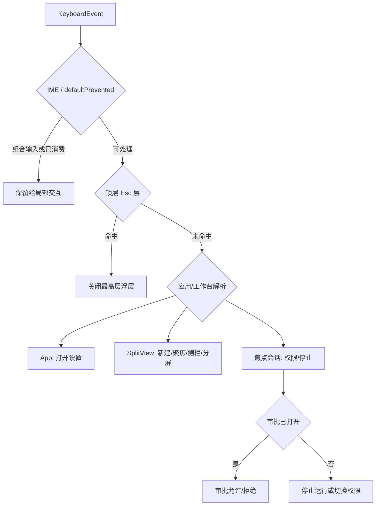

# Desktop 快捷键设计

Feature Name: desktop-keyboard-shortcuts
Updated: 2026-08-22

## Description

首批快捷键覆盖新建任务、输入框聚焦、设置、侧栏、分屏、权限模式和停止生成。实现复用现有状态所有者与 Esc 层栈，不引入全局命令总线，不改变当前发送与换行约定。

## Architecture



快捷键解析由纯函数统一描述；动作仍由真实状态所有者执行。工作台使用 `split.focused` 作为唯一焦点来源，会话组件通过 `hotkeysActive` 接收该状态。

## Components and Interfaces

### `app/shortcuts.ts`

- 提供应用快捷键解析和展示元数据。
- 审批 Enter 仅接受无修饰按键。
- 已被局部组件消费的事件不进入审批处理。

### `app/App.tsx`

- 处理主修饰键加 `,`，调用现有设置打开逻辑。
- 设置已经打开时保持幂等。

### `features/split/SplitView.tsx`

- 处理新建任务、聚焦 composer、侧栏和分屏动作。
- 快捷键帮助入口与弹窗位于任务侧栏。
- 帮助弹窗接入现有 `useEscLayer`。

### 本地会话组件

- `ChatView` 将 `hotkeysActive` 透传至 `LocalComposerHost` 和 `Composer`。
- `Composer` 仅在焦点格处理权限切换与停止生成。
- 停止生成复用现有 `ctl.stop()`，保留发送队列暂停语义。

### 云端会话组件

- `CloudTaskView` 将 `hotkeysActive` 透传至 `CloudComposer`。
- `CloudComposer` 仅在焦点格运行中处理停止生成。
- 云端会话不处理本地权限模式快捷键。

### `AskCard.tsx`

- 提问卡处理 Enter 后阻止事件冒泡，保证一次按键最多触发一个提交动作。

## Data Models

快捷键不新增持久化业务数据。展示与解析共享以下逻辑结构：

```ts
type ShortcutAction =
  | "new-task"
  | "focus-composer"
  | "open-settings"
  | "toggle-sidebar"
  | "split-right"
  | "split-down"
  | "toggle-permission"
  | "stop-generation";
```

任务侧栏显示状态继续使用现有本地存储键，分屏继续使用现有布局树和六格上限。

## Correctness Properties

1. 单个键盘事件最多执行一个不可逆动作。
2. 会话级动作仅作用于 `split.focused` 对应会话。
3. 顶层浮层 Esc 优先于审批 Esc，审批 Esc 优先于停止生成。
4. 输入法组合事件不触发发送、审批、权限切换或停止。
5. 带修饰键的 Enter 不触发审批允许。
6. 达到分屏上限时布局树保持不变。
7. macOS 使用 `Cmd`，Windows/Linux 使用 `Ctrl`，两者共享动作语义。

## Error Handling

- 不存在可聚焦 composer 时，聚焦动作无操作。
- 不存在焦点格或达到分屏上限时，分屏动作无操作。
- 权限切换失败时沿用 composer 的错误通知。
- 停止请求失败时沿用本地或云端 runtime 的既有错误处理。
- 设置页面未保存确认继续由现有 Esc 层和退出逻辑处理。

## Test Strategy

- 纯函数测试：主修饰键、物理键码、多余修饰键、审批 Enter 和 IME。
- 工作台测试：新建、聚焦、侧栏、两种分屏、六格上限、帮助弹窗。
- 本地会话测试：多格焦点隔离、两种权限切换键、Esc 停止和审批优先级。
- 云端会话测试：焦点格 Esc 停止与浮层优先级。
- 提问卡测试：Enter 提交后不冒泡，IME 和修饰键保持原行为。
- 运行 Desktop UI 的聚焦单测与 TypeScript 类型检查。

## References

- Cursor Keyboard Shortcuts: https://cursor.com/help/customization/keyboard-shortcuts.md
- VS Code Default Keyboard Shortcuts: https://code.visualstudio.com/docs/reference/default-keybindings
- VS Code AI Features Cheat Sheet: https://code.visualstudio.com/docs/agents/reference/ai-features-cheat-sheet
- Devin Desktop Cascade: https://docs.devin.ai/desktop/cascade/cascade.md
- Claude Code Interactive Mode: https://code.claude.com/docs/en/interactive-mode
- `desktop/ui-next/src/app/shortcuts.ts`
- `desktop/ui-next/src/features/split/SplitView.tsx`
- `desktop/ui-next/src/features/chat/composer/Composer.tsx`
