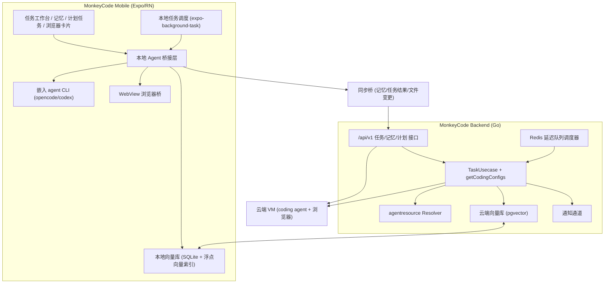

# 手机端 Agent 能力设计（记忆 / 定时任务 / 浏览器 GUI，云端+本地双模式）

Feature Name: mobile-agent-capabilities
Updated: 2026-08-26

## Description

参考 OmniBot 为 MonkeyCode 手机端（Expo / React Native，`mobile/`）增加三类 Agent 能力：长期记忆系统、定时/计划任务、浏览器 GUI 操作。三类能力同时支持云端（运行在云 VM，复用现有 taskflow / coding agent 链路）与本地（手机本地嵌入 agent CLI）双模式，任务、记忆与文件变更双向同步。

设计约束（用户决策）：
- **长期记忆**：双端各自向量库（云端向量库 + 本地向量库，同步协议合并）。
- **浏览器 GUI**：自研统一浏览器控制层协议，云端与本地共用同一套编排逻辑。
- **本地执行引擎**：嵌入 opencode CLI（保留可替换适配层，架构上兼容 codex 等其它 CLI）。

## Architecture



### 架构说明

- **现有云端链路保持不变**：任务创建 → `TaskUsecase.Create` → `getCodingConfigs`（注入 rule/skill/plugin，见 `backend/biz/task/usecase/task.go:876`）→ taskflow `CreateTaskReq`（含 `AgentResources`）→ VM 内 coding agent 执行。
- **本地链路**：手机端 `LocalAgent` 桥接层驱动嵌入的 agent CLI，将 CLI 事件（消息、工具调用、文件变更、权限请求）转译为现有任务流协议（`/api/v1/users/tasks/stream` WebSocket，见 `mobile/src/api/stream.ts`），从而复用前端 `TaskMessageHandler` 与后端日志链路。
- **浏览器统一层**：云端用 agent 内置浏览器，本地用 WebView 调试桥，两端都暴露同一套浏览器工具协议（open / click / type / scroll / snapshot / assert），由 agent 以 skill/工具形式调用。
- **记忆双端**：云端 pgvector 存全量记忆，本地 SQLite+向量索引存设备常用子集；同步桥按记录 `updated_at` 合并（LWW）。

## Components and Interfaces

### 1. 长期记忆系统

#### 1.1 数据模型

```
AgentMemory
├── id            UUID
├── scope_type    "user" | "team"
├── scope_id      UUID
├── content       TEXT            -- 记忆正文
├── tags          []string
├── source_task   UUID?           -- 来源任务（可为空）
├── source_type   "task"|"manual"|"import"
├── embedding     vector(1536)?   -- pgvector，维度随 embedding 模型
├── updated_at    timestamptz
└── deleted       bool            -- 软删除，同步用
```

本地表结构（SQLite）同构，`embedding` 存 `BLOB`（float32 数组），`deleted` 标记用于增量同步。本地检索采用 SQLite + 轻量浮点向量索引（如 `sqlite-vec` 扩展，或在记忆量小的阶段直接全表扫描 + 余弦距离计算），不引入外部向量库服务；向量维度随 embedding 模型（如 1536）。

#### 1.2 接口

- `POST /api/v1/memories` 创建记忆（手动录入或任务沉淀回调）
- `GET /api/v1/memories?query=&scope=&cursor=` 搜索（向量相似度 + 标签过滤，分页）
- `GET /api/v1/memories/{id}` / `DELETE /api/v1/memories/{id}` 单条查看/删除
- `POST /api/v1/tasks/{id}/memories/collect` 任务结束后将短期上下文沉淀为长期记忆
- `POST /api/v1/memories/sync` 本地→云端批量增量同步（游标+批量上限）

#### 1.3 任务注入

在 `getCodingConfigs` 之后、组装 `CreateTaskReq` 之前，新增记忆检索步骤：

```
retrieved = cloudMem.Search(taskContent, scope=user∪team, topK=8)
CreateTaskReq.SystemPrompt += "\n\n[长期记忆]\n" + retrieved.MarshalText()
```

本地模式由 `LocalAgent` 在启动 CLI 前查询本地向量库，将结果拼入 system prompt。云端检索失败降级为空，不阻塞任务（需求 1.6）。

#### 1.4 Embedding 扩展

现有 `domain/model.go` 的 `InterfaceType` 仅 `openai_chat/openai_responses/anthropic`。扩展：
- `consts.InterfaceType` 新增 `embedding`；
- `model.go` 校验枚举加入 `embedding`；
- 新增 `pkg/llm` embedding client，按模型配置的 base_url + key 调用 `/embeddings`，返回归一化向量；
- pgvector 字段启用需 migration（`backend/migration/`），检索用余弦距离 `<=>` 排序。

### 2. 定时 / 计划任务

#### 2.1 数据模型

```
ScheduledTask
├── id            UUID
├── user_id       UUID
├── name          TEXT
├── content       TEXT            -- 任务内容（agent prompt）
├── schedule_type "once" | "cron"
├── run_at        timestamptz?    -- once
├── cron_expr     TEXT?           -- cron（5 段）
├── mode          "cloud" | "local"
├── task_ids      []UUID          -- 已触发生成的子任务
├── enabled       bool
├── next_run_at   timestamptz
├── last_result   JSON?           -- 最近执行结果摘要
└── created_at / updated_at
```

#### 2.2 云端调度

复用 `backend/pkg/delayqueue`（Redis 延迟队列）：
- 创建/更新时间修改时，将 `next_run_at` 作为延迟投递时间入队（类似现有 `tasksummaryqueue.go` / `vmexpirequeue.go` 的用法）；
- consumer 到点取出 → 生成子任务（复用 `TaskUsecase.Create`）→ 更新 `next_run_at` → 重新入队（周期任务）；
- cron 解析用 `robfig/cron`（检查 go.mod 是否有依赖，无则新增）。

#### 2.3 本地调度

- 用 `expo-background-task` 注册后台任务，触发时检查本地 `ScheduledTask` 表；
- 到点任务交给 `LocalAgent` 启动本地执行；断网场景结果先落本地，恢复后经同步桥上报云端；
- `expo-notifications` 用于结果推送（复用现有 `backend/pkg/msgpush` 的云端推送链路也可）。

#### 2.4 接口

- `POST /api/v1/scheduled-tasks` / `GET` / `PATCH {id}` / `DELETE {id}`
- `POST /api/v1/scheduled-tasks/{id}/trigger` 手动立即触发
- 配额：不设硬性配额上限；通过资源限额告警与本地执行计量约束异常使用。

### 3. 浏览器 GUI 操作（统一控制层）

#### 3.1 统一浏览器工具协议

以 JSON-RPC 风格定义浏览器工具，作为 agent 可调用的 skill/工具：

```
BrowserToolRequest   { tool: "browser_open"|"browser_click"|"browser_type"|"browser_scroll"|"browser_snapshot"|"browser_assert"|"browser_navigate", params: {...}, request_id }
BrowserToolResponse  { request_id, ok, screenshot?, dom_state?, assertion?, error? }
```

- `browser_snapshot` 返回可访问性树 + 截图（base64），供 agent 视觉判断；
- `browser_assert` 支持选择器/文本/URL 断言，返回 pass/fail + 截图；
- 超时（默认 30s）、重试与安全校验（URL 白名单）在控制层统一处理。

#### 3.2 云端实现

作为 skill 打包下发（走现有 `agentresource` skill 链路），VM 内 agent 通过浏览器驱动（复用 coding agent 浏览器能力）执行，事件经现有 `TaskStreamTypeTaskEvent` 回传。

#### 3.3 本地实现

- 本地浏览器桥用 `react-native-webview` 加载目标页，通过 `injectedJavaScript` + `onMessage` 桥接控制指令与页面状态；
- `LocalAgent` 将 `BrowserToolRequest` 转发给 WebView 桥，WebView 返回 `BrowserToolResponse`；
- 截图通过 WebView `captureRef` 或页面内 `html2canvas` 获取。

#### 3.4 前端展示

任务消息流新增 `browser-operation` 事件类型（沿用 `TaskStreamTypeTaskEvent` 容器），前端 `StreamBlocks.tsx` 增加浏览器操作卡片（截图 + 操作摘要 + 断言结果），点击可查看大图。

### 4. 双模式执行与同步

#### 4.1 任务执行模式

- `CreateTaskReq` 增加 `mode: "cloud" | "local"`（缺省取用户默认）；
- 云端：走现有链路；
- 本地：`LocalAgent` 通过 **CLI 适配层**初始化本地执行环境（下载/解压 opencode CLI，配置模型与资源），将任务 payload（含 `AgentResources` 的 presigned zip URL）下发到 CLI，CLI 事件经流协议转发。适配层定义统一的 `AgentCLI` 接口（启动/停止/事件流/输入转发），当前实现绑定 opencode，架构上可替换 codex 等其它 CLI。

#### 4.2 同步桥

同步范围：记忆（LWW by updated_at）、任务结果（完成状态 + summary + 文件 diff 关联）、本地执行的任务事件日志。

```
LocalAgent --(POST /memories/sync, PATCH /tasks/{id}/status)--> Backend
```

#### 4.3 环境与失败回退

- 本地环境初始化失败 → 提示用户切换云端模式（需求 4.4）；
- 本地 token 用量/时长计量复用 backend 现有 modelusage / 任务统计，由同步桥上报。

### 5. 手机端交互

- `mobile/app/(tabs)/tasks.tsx` 增加执行模式筛选；
- 新增 `mobile/app/memories.tsx` 记忆管理与搜索页；
- 新增 `mobile/app/scheduled-tasks.tsx` 计划任务管理页；
- `mobile/app/task/[id].tsx` 增加记忆注入摘要与浏览器操作卡片展示；
- `mobile/src/components/` 新增 `MemoryCard`、`ScheduledTaskCard`、`BrowserCard`。

## Data Models

沿用第 1.1 / 2.1 节 ER 描述。关键点：
- `AgentMemory.embedding` 云端为 pgvector（migration 新增），本地为 SQLite BLOB；
- `ScheduledTask` 云端在 `backend/ent/schema` 新增，本地在 SQLite 表同构；
- 任务表 `db.Task` 需增加 `mode` 字段（或复用 `Extra`），`db.ProjectTask` 增加 `mode` 透出。

## Correctness Properties

1. 记忆检索失败不得阻塞任务创建（`getCodingConfigs` 与本地注入均降级为空）。
2. 记忆双端同步采用 LWW，`updated_at` 更新者胜；软删除同步到两端。
3. 计划任务到点生成子任务具备幂等性：延迟队列 payload 携带 `run_id`，重复消费只创建一次子任务。
4. 周期任务 `next_run_at` 推进在子任务创建成功之后执行，避免漏跑与重复。
5. 本地模式所有写操作（记忆、任务状态、文件变更）均带 `client_ts`，云端以较大时间戳收敛。
6. 浏览器操作超时/失败返回结构化错误，不影响 agent 主循环。
7. 配额校验在创建与执行两处同时生效：计划任务采用资源限额告警与执行计量约束，不设硬配额；本地执行时长/token 计量沿用现有 modelusage 统计，异常时限制继续执行。

## Error Handling

| 场景 | 处理 |
|---|---|
| embedding 模型未配置 | 记忆写入/检索返回明确错误，任务创建不依赖记忆继续 |
| cron 表达式非法 | `PATCH/POST` 返回 400 + 可读错误 |
| 本地 agent CLI 初始化失败 | 任务标记 error，提示切换到云端模式 |
| 本地断网 | 任务事件落本地队列，同步桥恢复后重放上报 |
| 云端延迟队列消费失败 | 沿用 delayqueue 重试（maxAttempts=5）+ 失败后重置 next_run_at |
| 浏览器 URL 越权 | 拒绝并返回安全提示 |
| 同步冲突 | 按 updated_at / client_ts LWW 收敛 |

## Test Strategy

- 后端：`getCodingConfigs` 注入记忆的单元测试；记忆向量检索（fake embedding client）测试；计划任务 cron 解析与延迟队列幂等测试；同步接口 LWW 测试。
- 移动端：jest 覆盖记忆页、计划任务页、浏览器卡片的渲染与交互（沿用 `mobile/` 现有 jest 配置）；`TaskMessageHandler` 对 `browser-operation` 事件的解析测试；CLI 适配层对 opencode 事件流解析的 mock 测试。
- 集成：云端任务端到端（创建→记忆注入→执行→沉淀）；本地任务端到端（mock CLI，验证事件转译与同步上报）。
- 验证命令：`cd backend && go test ./...`；`cd mobile && npm test`。

## References

[^1]: (GitHub) - [OmniBot README（参考能力清单）](https://github.com/omnimind-ai/OmniBot)
[^2]: (backend/biz/task/usecase/task.go#L876) - `getCodingConfigs`：rule/skill/plugin 注入入口
[^3]: (backend/biz/agentresource/resolver.go#L249) - `SkillRefsScoped`：三级 skill 解析与 presign 下发
[^4]: (backend/pkg/taskflow/types.go#L621) - `AgentResources`：skill/plugin 下发结构
[^5]: (backend/pkg/delayqueue/delayqueue.go) - Redis 延迟队列（计划任务云端调度基座）
[^6]: (backend/domain/model.go#L211) - 模型 `InterfaceType` 枚举（需扩展 embedding）
[^7]: (mobile/src/api/stream.ts) - 任务流 WebSocket 协议（本地事件转译目标）
[^8]: (mobile/app/task/[id].tsx) - 手机端任务详情页（交互扩展目标）
