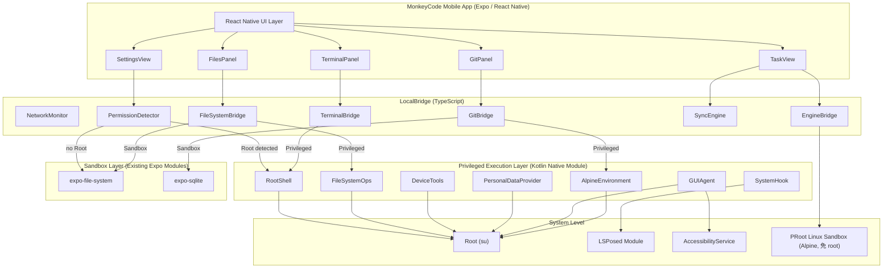

# 手机端本地能力技术设计

Feature Name: mobile-local-capabilities
Updated: 2026-08-26

## Description

本设计文档描述 MonkeyCode 手机端（Android）如何实现双模式本地能力架构。参考 Eta-HyperOS 项目，通过 Root + LSPosed 实现特权执行层，使 AI Agent 能够越过 App 沙盒真实操作手机设备。无 Root 时自动降级为沙箱模式。

## Architecture



### 三层架构

**UI 层 (React Native / Expo)**：复用现有组件，增加特权模式状态标识和工具入口。沙箱模式下显示可用的基础功能，特权模式下展示完整能力。

**LocalBridge 层 (TypeScript)**：核心调度层，统一管理沙箱和特权两种执行路径。PermissionDetector 在启动时检测 Root + LSPosed 状态，决定启用哪条路径。所有原生模块调用经此层统一管理。

**执行层 (Native Modules)**：分两条路径：
- **特权执行层 (PrivilegedExecutionLayer)**：新增的 Kotlin 原生模块，参考 Eta 架构实现 Root shell、文件系统、系统 API、GUI Agent、LSPosed Hook、Alpine Linux 环境
- **沙箱层 (SandboxLayer)**：现有 Expo 模块，提供受限的基础能力

### 与 Eta-HyperOS 的集成方式

Eta-HyperOS 是一个**独立的 Android App**（Kotlin + Compose）。MonkeyCode 手机端是 **Expo / React Native 应用**。集成策略：

1. **提炼 Eta 核心模块为独立 Kotlin 库**：将 Eta 的 Agent Runtime、Root Shell、GUI Agent、系统 Hook 等核心能力提炼为独立的 Android 库模块
2. **通过 Expo Config Plugin 注入**：创建 Expo Config Plugin，将 Kotlin 库注入到 MonkeyCode 的 Android 原生层
3. **TypeScript 桥接**：通过 React Native 的 NativeModules 机制，在 TypeScript 侧暴露 Kotlin 模块的接口

### 项目结构

```
mobile/
├── app/                     # Expo Router 页面
├── src/
│   ├── local/               # LocalBridge TypeScript 层
│   │   ├── PermissionDetector.ts
│   │   ├── FileSystemBridge.ts
│   │   ├── TerminalBridge.ts
│   │   ├── GitBridge.ts
│   │   ├── EngineBridge.ts
│   │   ├── SyncEngine.ts
│   │   ├── NetworkMonitor.ts
│   │   └── OfflineContext.tsx
│   ├── native/              # 现有原生模块桥接
│   │   ├── alipayAuth.ts
│   │   ├── douyinAuth.ts
│   │   └── fileSaver.ts
│   └── components/          # UI 组件
├── plugins/                 # Expo Config Plugins
│   ├── withAlipayLogin.js
│   ├── withDouyinLogin.js
│   ├── withAndroidFileSaver.js
│   └── withPrivilegedExecution.js  # 新增：特权执行层插件
├── android/                 # Android 原生代码 (expo prebuild 生成)
│   └── app/src/main/java/com/monkeycode/privileged/
│       ├── PrivilegedExecutionModule.kt    # NativeModule 入口
│       ├── RootShellManager.kt             # Root shell 管理
│       ├── FileSystemOps.kt                # 文件系统操作
│       ├── DeviceTools.kt                  # 系统 API 工具
│       ├── PersonalDataProvider.kt         # 个人数据读取
│       ├── GUIAgent.kt                     # GUI Agent
│       ├── AccessibilityService.kt         # 无障碍服务
│       ├── SystemHookManager.kt            # LSPosed Hook 管理
│       ├── AlpineEnvironment.kt            # Alpine Linux 环境
│       └── AgentRuntime.kt                # Agent Runtime (参考 Eta AgentLoop)
├── lsposed/                 # LSPosed 模块 (独立 Gradle 模块)
│   ├── build.gradle.kts
│   └── src/main/
│       ├── AndroidManifest.xml
│       └── java/com/monkeycode/hook/
│           ├── ModuleMain.kt              # LSPosed 入口
│           ├── SystemServerHook.kt        # system_server Hook
│           ├── SystemUIHook.kt            # SystemUI Hook
│           └── AssistantHook.kt           # 厂商助手 Hook
├── package.json
└── app.json
```

## Components and Interfaces

### 1. PermissionDetector

权限检测器，在应用启动时检测 Root 和 LSPosed 状态。

```
interface PermissionDetector {
  detectRoot(): Promise<RootInfo>;
  detectLSPosed(): Promise<LSPosedInfo>;
  getExecutionMode(): Promise<'sandbox' | 'privileged'>;
  onModeChange: (mode: 'sandbox' | 'privileged') => void;
}

interface RootInfo {
  available: boolean;
  manager: 'magisk' | 'kernelsu' | 'apatch' | 'unknown' | null;
  version: string | null;
}

interface LSPosedInfo {
  available: boolean;
  version: string | null;
  apiVersion: number | null;
}
```

### 2. PrivilegedExecutionModule (Kotlin NativeModule)

特权执行层的统一入口，暴露所有特权能力给 React Native 侧。

```kotlin
class PrivilegedExecutionModule(reactContext: ReactApplicationContext) :
    ReactContextBaseJavaModule(reactContext) {

    override fun getName(): String = "PrivilegedExecution"

    // Root Shell
    @ReactMethod
    fun execCommand(command: String, identity: String, promise: Promise)

    @ReactMethod
    fun createShellSession(workDir: String, identity: String, promise: Promise)

    @ReactMethod
    fun writeToSession(sessionId: String, data: String, promise: Promise)

    @ReactMethod
    fun destroySession(sessionId: String, promise: Promise)

    // File System
    @ReactMethod
    fun listDirectory(path: String, promise: Promise)

    @ReactMethod
    fun readFile(path: String, encoding: String, promise: Promise)

    @ReactMethod
    fun writeFile(path: String, content: String, promise: Promise)

    @ReactMethod
    fun createDirectory(path: String, promise: Promise)

    @ReactMethod
    fun deleteEntry(path: String, promise: Promise)

    // Device Tools
    @ReactMethod
    fun setAlarm(hour: Int, minute: Int, label: String, promise: Promise)

    @ReactMethod
    fun mediaControl(action: String, promise: Promise)

    @ReactMethod
    fun setVolume(stream: String, level: Int, promise: Promise)

    @ReactMethod
    fun toggleWifi(enable: Boolean, promise: Promise)

    @ReactMethod
    fun getDeviceStatus(promise: Promise)

    // Personal Data
    @ReactMethod
    fun queryGallery(limit: Int, promise: Promise)

    @ReactMethod
    fun queryCalendar(startTime: Long, endTime: Long, promise: Promise)

    @ReactMethod
    fun querySMS(limit: Int, promise: Promise)

    @ReactMethod
    fun queryNotifications(limit: Int, promise: Promise)

    // GUI Agent
    @ReactMethod
    fun takeScreenshot(promise: Promise)

    @ReactMethod
    fun getAccessibilityTree(promise: Promise)

    @ReactMethod
    fun performClick(x: Float, y: Float, promise: Promise)

    @ReactMethod
    fun performSwipe(x1: Float, y1: Float, x2: Float, y2: Float, promise: Promise)

    @ReactMethod
    fun performInput(text: String, promise: Promise)

    // Alpine Linux
    @ReactMethod
    fun installAlpineEnvironment(promise: Promise)

    @ReactMethod
    fun isAlpineInstalled(promise: Promise)

    @ReactMethod
    fun execAlpineCommand(command: String, promise: Promise)

    // Events
    fun sendEvent(eventName: String, params: WritableMap)
}
```

### 3. RootShellManager

Root shell 会话管理，参考 Eta 的 ShellProcessSupervisor 设计。

```
RootShellManager:
  - createSession(identity: 'user' | 'root', workDir: String): Session
  - destroySession(sessionId: String)
  - execAsync(command: String, identity: String): AsyncJob
  - 通过 setsid 创建独立进程组
  - 取消时通过 processGroup 终止进程树
  - 自动探测 BusyBox 并以 standalone ash 补齐 PATH
```

### 4. GUIAgent

GUI Agent，参考 Eta 的无障碍 + 截图方案。

```
GUIAgent:
  - takeScreenshot(): Bitmap (通过 screencap 或 MediaProjection)
  - getAccessibilityTree(): AccessibilityNodeInfo (通过 AccessibilityService)
  - performClick(x, y): 通过 AccessibilityService 或 input tap
  - performSwipe(x1, y1, x2, y2): 通过 AccessibilityService 或 input swipe
  - performInput(text): 通过 AccessibilityService 或剪贴板
  - 前台操作显示浮层和手势反馈
  - 用户可随时停止或接管
```

### 5. AccessibilityService

无障碍服务，参考 Eta 的无障碍保护机制。

```
AccessibilityService:
  - 注册为 Android AccessibilityService
  - 提供节点树查询
  - 执行点击、滚动、输入操作
  - 断连时自动重绑（最多 3 次，冷却 1 分钟）
  - 通过 system_server Hook 保护服务不被系统杀死
```

### 6. SystemHook (LSPosed 模块)

系统 Hook 模块，参考 Eta 的 Hook 安装与诊断方案。

```
LSPosed Module:
  - ModuleMain: 入口，过滤无关进程，调用 detach()
  - SystemServerHook: 电源键接管、数字助理配置修复
  - SystemUIHook: 手势条拦截
  - AssistantHook: 厂商助手（小布/小爱）入口接管
  - 每个 Hook 通过 HookRegistrar 注册，使用稳定 ID
  - 安装结果区分 INSTALLED/MISSING/FAILED/SKIPPED
  - 目标签名漂移时停止 Hook 并记录
```

### 7. AlpineEnvironment (PRoot 免 root)

内置 Linux 工具环境，参考 OpenMinis / Operit / shiyi-agent 的方案。

```
AlpineEnvironment:
  - PRoot 用户态 chroot（免 root），取代需 root 的 mount namespace + chroot
  - PRoot 二进制 + Alpine minirootfs 由 prepare_android_sandbox.sh 固化进 APK assets
  - assets 缺失时在线下载固定版本兜底，校验 SHA-256
  - 绑定 /proc、/dev、/sdcard、/workspace 到 App 工作目录
  - 预装 Git、Python、rg、fd、curl、jq、SQLite、压缩工具
  - 沙箱模式（无 root）也能运行完整 Linux 工具链
```

### 8. AgentRuntime

Agent Runtime：**自研引擎（无上游 ohmyagent）**，直接对接桩排 LLM API，参考 Eta 的 AgentLoop 设计。

```
AgentRuntime (Kotlin, 内嵌):
  - AgentLoop: 单次 run 的状态机
    - 初始输入 → provider response → assistant history
    - → tool batch (串行) → tool results → 消费 steering 队列 → next turn
  - 工具执行统一通道：
    - Root 可用 → RootShellManager / FileSystemOps / GUIAgent（提权操作手机，对齐 Eta）
    - 无 Root   → AlpineEnvironment (PRoot 免 root 沙箱) 兜底
  - agent 工具：read_file/write_file/list_directory/exec_command/
    install_package/screenshot/gui_click/gui_type/get_accessibility_tree
  - AgentConfig: model/baseUrl/apiKey/contextWindow/maxOutput/initialInput/workDir
  - 工具参数执行前按 JSON Schema 重新校验（模型输出不可信）
  - 帧词汇对齐桌面端：task-running/acp_event、tool_call、task-ended
  - 经 PrivilegedExecutionModule 暴露给 RN：startAgent/sendAgentInput/cancel/pause/stop
```

### 9. FileSystemBridge (TypeScript)

```
interface FileSystemBridge {
  listDirectory(path: string): Promise<FileEntry[]>;
  readFile(path: string, encoding?: 'utf8' | 'base64'): Promise<string>;
  writeFile(path: string, content: string): Promise<void>;
  createDirectory(path: string): Promise<void>;
  deleteEntry(path: string): Promise<void>;
  getInfo(path: string): Promise<FileInfo>;
  // 根据执行模式自动选择执行路径
  getMode(): 'sandbox' | 'privileged';
}
```

### 10. TerminalBridge (TypeScript)

```
interface TerminalBridge {
  createSession(workDir: string, identity?: 'user' | 'root'): Promise<string>;
  write(sessionId: string, data: string): void;
  resize(sessionId: string, cols: number, rows: number): void;
  destroySession(sessionId: string): void;
  onData: (sessionId: string, data: string) => void;
  onExit: (sessionId: string, exitCode: number) => void;
  // 沙箱模式下不可用
  isAvailable(): boolean;
}
```

### 11. GitBridge (TypeScript)

```
interface GitBridge {
  getStatus(path: string): Promise<GitStatus>;
  stageFiles(path: string, files: string[]): Promise<void>;
  commit(path: string, message: string): Promise<string>;
  push(path: string, remote?: string, branch?: string): Promise<void>;
  pull(path: string, remote?: string, branch?: string): Promise<void>;
  listBranches(path: string): Promise<GitBranch[]>;
  switchBranch(path: string, name: string): Promise<void>;
  getDiff(path: string, file?: string): Promise<string>;
  // 沙箱模式: isomorphic-git
  // 特权模式: Alpine Linux 原生 git
}
```

## Data Models

### TypeScript 类型定义

```typescript
// 执行模式
type ExecutionMode = 'sandbox' | 'privileged';

// 权限状态
interface PermissionState {
  mode: ExecutionMode;
  root: RootInfo;
  lsposed: LSPosedInfo;
  capabilities: {
    shell: boolean;
    rootShell: boolean;
    fileSystem: boolean;
    systemAPI: boolean;
    personalData: boolean;
    guiAgent: boolean;
    systemHook: boolean;
    alpineLinux: boolean;
  };
}

// 特权执行配置
interface PrivilegedConfig {
  // 设备直达
  deviceToolsEnabled: boolean;
  // 敏感信息读取
  sensitiveDataEnabled: boolean;
  // 敏感设备操作
  sensitiveOpsEnabled: boolean;
  // 终端/文件
  terminalEnabled: boolean;
  terminalIdentity: 'user' | 'root';
  // GUI 操作
  guiAgentEnabled: boolean;
  // 系统 Hook
  systemHookEnabled: boolean;
  // Alpine Linux
  alpineInstalled: boolean;
}

// 本地项目
interface LocalProject {
  id: string;
  name: string;
  path: string;
  remoteUrl?: string;
  cloudProjectId?: string;
  mode: ExecutionMode;
  createdAt: number;
  updatedAt: number;
}

// 本地任务
interface LocalTask {
  id: string;
  cloudTaskId?: string;
  projectId: string;
  title: string;
  status: 'created' | 'running' | 'idle' | 'finished' | 'interrupted' | 'error';
  mode: 'local' | 'cloud';
  executionMode: ExecutionMode;
  engineId?: string;
  createdAt: number;
  updatedAt: number;
}
```

## Correctness Properties

### 不变性约束

1. **模式不可降级升级**：一次任务执行期间，执行模式（沙箱/特权）固定不变。如果权限在任务执行期间丢失，当前任务继续以原模式完成，下一个任务降级。

2. **Root shell 进程组隔离**：每个 shell 会话使用独立进程组（setsid），取消时通过进程组终止，防止误杀无关进程。

3. **文件路径安全**：所有文件操作路径必须经过规范化和校验。特权模式下允许任意路径，沙箱模式下限制在 App 私有目录。

4. **敏感数据脱敏**：通知正文、短信验证码、Wi-Fi 密码等敏感数据仅在当前回合使用，不写入持久会话。

5. **工具参数校验**：模型输出不是可信输入，所有工具参数在执行前按 Schema 重新校验。

6. **Hook 安全边界**：每个 Hook 独立注册，目标签名漂移时自动停止，不静默降级。

7. **无障碍保护**：GUI 操作前确认无障碍服务真实连接，不使用 Root 偷偷修改无障碍设置。

### 状态机

**执行模式状态机：**

```
[Uninitialized] → [Detecting] → [Sandbox] | [Privileged]
                                      │            │
                                      │            └─── Root 丢失 → [Sandbox]
                                      │
                                      └─── 不可逆（无 Root 设备）
```

**引擎状态机（对标桌面端契约 6）：**

```
[Stopped] → [Starting] → [Ready] → [Crashed]
                │                       │
              启动失败                熔断(3次)
                ▼                       ▼
            [Failed] ◄─────────────────┘
```

## Error Handling

| 错误类型 | 处理策略 | 用户提示 |
|---------|---------|---------|
| Root 权限不足 | 降级到沙箱模式 | "设备未获取 Root 权限，部分高级功能不可用" |
| LSPosed 未安装 | 降级到沙箱模式 | "LSPosed 未安装，系统 Hook 功能不可用" |
| Root shell 执行失败 | 返回错误码 | "命令执行失败：{error}" |
| 文件操作越界 | 沙箱模式拒绝，特权模式允许 | 沙箱："无法访问 App 沙箱外的文件路径" |
| GUI Agent 无障碍断开 | 自动重绑 3 次 | "无障碍服务断连，正在重连..." |
| Hook 目标签名漂移 | 停止 Hook，记录缺失 | "系统组件已更新，{功能}暂时不可用" |
| Alpine 安装校验失败 | 拒绝启动 Linux 环境 | "Linux 环境安装校验失败，请重新安装" |
| 引擎启动失败 | 退避重试 1/2/4s，最多 3 次 | "引擎启动失败，请检查设备存储空间" |
| 引擎崩溃 | 自动重启，保留会话 | "引擎意外退出，正在自动恢复..." |
| 存储空间不足 | 阻止操作，提示清理 | "设备存储空间不足，请至少保留 500MB 可用空间" |

## Test Strategy

### 测试层次

| 层次 | 范围 | 工具 | 覆盖目标 |
|------|------|------|---------|
| 单元测试 | TypeScript LocalBridge | Jest | 模式检测、状态机、同步逻辑 |
| 单元测试 | Kotlin 特权模块 | JUnit | RootShell、FileSystem、DeviceTools |
| 集成测试 | NativeModule 接口 | Jest + NativeModules mock | 桥接层接口契约 |
| 组件测试 | UI 组件 | Jest + RNTL | 特权模式 UI、沙箱模式灰显 |
| E2E 测试 | 真机 Root 设备 | 手动 | 特权模式完整流程 |

## References

[^1]: Eta-HyperOS 项目 - https://github.com/tall-1997/Eta-HyperOS
[^2]: Eta 技术实现文档 - https://github.com/tall-1997/Eta-HyperOS/blob/main/docs/TECHNICAL.md
[^3]: Eta Agent Runtime 文档 - https://github.com/tall-1997/Eta-HyperOS/blob/main/docs/AGENT_RUNTIME.md
[^4]: 桌面端架构文档 - `当前工作区` 内的 `/desktop/ARCHITECTURE.md`
[^5]: mobile-agent-capabilities 规格 - `当前工作区` 内的 `.monkeycode/specs/mobile-agent-capabilities/tasklist.md`
[^6]: 桌面端 Rust Shell 源码 - `当前工作区` 内的 `/desktop/src/main.rs`
[^7]: 手机端现有代码 - `当前工作区` 内的 `/mobile/src/`