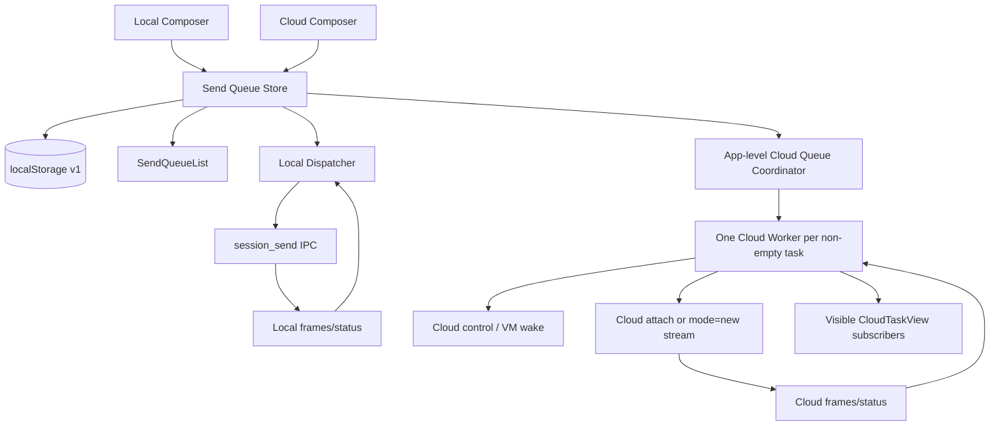
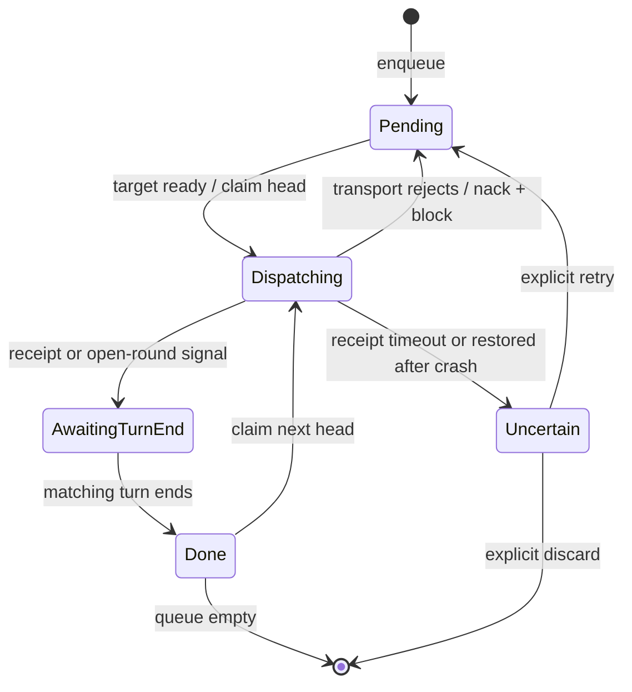

# 多条待发送消息队列

Feature Name: `multi-message-send-queue`
Updated: 2026-08-20

## Description

本设计把桌面端本地会话和云端任务的单槽待发送状态替换为按目标隔离的持久化有序队列。用户可以在当前轮运行或消息投递期间继续添加消息、拖动调整顺序、逐项删除；系统在每轮结束后只投递一条队首消息。

本地会话继续使用 `session_send`，云端任务继续使用 `mode=new` 流。共享模块统一队列模型与视图，但保留两套传输适配。云端队列由 App 级协调器持有，因此用户切离任务视图后仍会在后台逐轮发送。

## Architecture



### 分层

1. **队列领域层**：提供追加、删除、重排、领取队首、确认、失败回队和持久化恢复。
2. **本地适配层**：把本地正文与附件转换为 `session_send` 内容，沿用历史加载、会话纪元、帧水位和后台状态事件守卫。
3. **云端协调层**：在 App 生命周期内为每个打开或队列非空的云端任务维护唯一 runtime，统一拥有详情轮询、control、attach、`mode=new` 和队列投递。
4. **云端视图层**：订阅共享 runtime 的状态与帧，不再独立创建云端连接。
5. **共享视图层**：展示可排序队列和不可操作的发送中项，处理原生 HTML5 拖放。

## Components and Interfaces

### 1. `sendQueue.ts`

建议新增 `desktop/ui-next/src/features/chat/composer/sendQueue.ts`，包含数据类型、纯状态转换和版本化存储适配。

```ts
export type SendQueueScope = "local" | "cloud";

export interface SendQueueItem<A> {
  id: string;
  content: string;
  attachments: A[];
  createdAt: number;
}

export type InFlightPhase =
  | "dispatching"
  | "awaiting-receipt"
  | "awaiting-turn-end"
  | "uncertain";

export interface SendQueueLane<A> {
  version: 1;
  pending: SendQueueItem<A>[];
  inFlight: {
    item: SendQueueItem<A>;
    phase: InFlightPhase;
    baselineSeq?: number;
    startedAt: number;
  } | null;
  blocked: {
    code:
      | "send-rejected"
      | "receipt-unknown"
      | "control-offline"
      | "transport-changed"
      | "unauthorized"
      | "vm-failed"
      | "task-ended"
      | "task-missing";
    message: string;
    at: number;
  } | null;
}
```

领域操作：

```ts
enqueue(lane, item): SendQueueLane
remove(lane, itemId): SendQueueLane
reorderBefore(lane, itemId, beforeId | null): SendQueueLane
claimHead(lane, metadata): SendQueueLane
markReceipt(lane, itemId): SendQueueLane
completeTurn(lane, itemId): SendQueueLane
nackHead(lane, itemId): SendQueueLane
block(lane): SendQueueLane
confirmResume(lane): SendQueueLane
```

所有操作返回新值；每次状态转换后同步写入 `localStorage`。`claimHead` 必须先把状态持久化为 `inFlight`，再调用传输层。

### 2. `SendQueueList.tsx`

建议新增 `desktop/ui-next/src/features/chat/composer/SendQueueList.tsx`，供 `Composer.tsx` 和 `CloudComposer.tsx` 复用。

接口：

```ts
interface SendQueueListProps<A> {
  pending: SendQueueItem<A>[];
  inFlight: SendQueueLane<A>["inFlight"];
  onRemove(id: string): void;
  onReorder(id: string, beforeId: string | null): void;
}
```

交互规则：

- 发送中项单独显示在列表顶部，带 spinner，不提供拖动和删除。
- 待发送项显示专用拖拽把手、正文单行摘要、附件数量和删除按钮。
- 拖放使用项目已有的原生 `draggable` 模式，不增加依赖；落点显示插入指示线。
- 内部拖动写入自定义 MIME，父级文件拖放仅处理 `kind === "file"`，避免排序拖动被误判为附件上传。
- 删除和拖动按稳定 ID 操作，不使用数组下标。
- 正文预览使用截断样式并通过 `title` 提供完整文本。

### 3. 本地会话适配

修改 `useComposer.ts`：

- `ComposerCtl.queued` 替换为 `queue.pending`、`queue.inFlight`、`removeQueued` 和 `reorderQueued`。
- 入队时保留结构化 `{ content, attachments: ComposerAtt[] }`；只有真正投递时才使用 `attLineOf` 合成最终正文。
- 当 `running || sendingRef.current || pending.length > 0 || inFlight` 时，新消息追加到队尾，不再覆盖旧消息。
- 自动投递沿用 `historyLoaded`、`stateSid === sessionId`、`sendingRef` 和失败退避守卫。
- 帧水位确认上行已物化；对应轮次从 `running=true` 转为 `false` 后完成发送中项，并领取下一条。
- 发送失败把同一项恢复到队首、设置 `blocked=true` 并展示错误；新帧、轮次变化、退避到点或用户再次提交时沿用现有规则解除阻塞。

修改 `stash.ts`：

- `StashEntry` 只保留草稿和当前附件；待发送队列改由持久化队列模块按 session ID 管理。
- `deliverQueued` 改为读取目标 session 的队列，每次状态结束只领取并投递一个队首项。
- 后台发送成功后等待下一次 `session-status` 结束事件再处理下一项，保持逐轮语义。
- `dropStash` 同时删除 `mc.sendQueue.v1.local.<sessionId>`。

### 4. App 级云端队列协调器

建议新增：

- `desktop/ui-next/src/features/cloud/CloudQueueCoordinator.tsx`
- `desktop/ui-next/src/features/cloud/cloudTaskRuntime.ts`

`App.tsx` 常驻挂载一个 `CloudQueueCoordinator`。协调器按 `accountScope + taskId` 创建至多一个命令式 runtime。runtime 是该任务云端 transport 的唯一所有者；打开任务视图只增加订阅引用，不创建第二套连接。

```ts
interface CloudTaskRuntime {
  acquire(reason: "view" | "queue"): { release(): void };
  subscribe(listener: RuntimeListener): () => void;
  sendFrame(type: string, payload?: unknown): Promise<void>;
  borrowControl(): { ctrl: CloudControl; release(): void };
  confirmResume(): void;
  dispose(): void;
}

interface CloudRuntimeDeps {
  readLane(taskId: string): SendQueueLane<CloudQueueAttachment>;
  updateLane(taskId: string, update: LaneUpdate): void;
  taskInfo(taskId: string): Promise<CloudTaskDetail>;
  connectControl(taskId: string): CloudControl;
  connectStream(
    taskId: string,
    mode: "attach" | "new",
    handlers: StreamHandlers,
    input?: CloudUserInput,
  ): CloudStreamConn;
}
```

runtime 生命周期：

1. `viewRefs > 0` 或队列存在可执行 pending/in-flight 时保留 runtime；二者均不存在时释放详情轮询、control、stream 和计时器。
2. runtime 先拉取详情并进入 `reconciling`。pending 且尚无 VM 时只轮询；VM hibernated 时建立 control 触发 Resume 并保活。
3. 任务处于 processing 且当前轮状态未知时，用 `attach` 对表；`onIdle` 才确认可发送，收到业务帧则等待 `task-ended`。
4. 只有任务可接收、当前轮已确认空闲、无 in-flight、队列未 blocked 且 generation/account 仍有效时，才能原子领取队首并用 `mode=new` 投递。
5. 首批有效帧把发送中项推进到 `awaiting-turn-end`；`task-ended` 完成该项、刷新详情并在下一微任务继续一个队首。
6. runtime 把帧、详情和连接状态广播给所有前台订阅者；没有视图时只执行维持逐轮发送所需的最小归约。

协调器/runtime 是云端详情轮询、control、attach、`mode=new` 和队列投递的**唯一所有者**。`CloudTaskView/useCloudTask` 只能订阅同一个 runtime。这样切离视图不会中断后台轮次，重新打开也不会产生双 attach、双 control 或双投递。

为支持运行期动态发现队列，`sendQueue.ts` 维护 `mc.sendQueue.v1.cloud.index`，并在同一页面内通过模块级订阅器发布 lane/index 变化。协调器使用 `useSyncExternalStore` 或等价订阅读取索引，不依赖浏览器只对其他窗口触发的 `storage` 事件。

每次 dispatch 记录 `{generation, runtimeEpoch, taskId, itemId, streamId}` token。异步回调必须完整匹配 token 才能更新 lane。账号退出或 transport generation 变化时，协调器同步失效全部 token、关闭旧 runtime 并把旧账号 lane 留在原命名空间；切回对应账号后仍以 blocked 状态等待用户确认，不自动续发。

### 5. 云端任务适配

修改 `useCloudTask.ts`：

- `outboxRef` 单槽替换为对持久化 lane 的订阅；云端附件持久化为 `{ url, filename, isImage }`，排除可能很大的 `preview` data URL。
- `sendingRef.current` 或 `chat.running` 为真时，提交动作改为追加队列并清空草稿和附件。
- 即使任务空闲且队列为空，提交也先 `enqueue`；App 级协调器会立即领取队首，保证前台和后台只有一条投递路径。
- 移除 hook 内的详情轮询、`connRef`、`ctrlRef`、VM 押后 outbox、`dispatch` 和队列推进职责。
- hook 通过 `useCloudQueueTask(task.id)` acquire 并订阅共享 runtime，把 runtime 帧喂给现有 `reduceBatch`，从 runtime 获取详情和连接状态。
- 审批/提问上行通过 runtime 的 `sendFrame`；文件、模型和任务操作通过 runtime 的 `borrowControl`，不另建前台 control。
- hook 继续负责当前视图的 ChatState 投影、历史翻页、composer 草稿、附件上传和菜单 UI。

修改 `CloudComposer.tsx`：

- `h.sending` 存在时仍允许用户录入并提交后续消息；发送按钮只在输入为空或附件上传中禁用。
- 发送中提示与待发送列表统一交给 `SendQueueList`。

修改 `CloudTaskView.tsx`：

- 任务结束态也显示队列异常横幅，避免 composer 不渲染时失去恢复入口。
- 可恢复 block 提供“确认继续”；`uncertain` 提供明确的“确认重试此条”；任务已结束或不存在时提供“停止后台发送并删除队列”。
- 后台 runtime 首次进入 blocked 时发送一次 App 级 attention；点击提醒通过现有云端 slot 装载入口打开对应任务。

修改云端任务删除路径：

- App 的统一云端任务删除成功回调先调用 `cloudQueue.dropTask(id)`：失效 runtime、关闭连接和计时器、删除 lane 与索引项，再刷新任务列表并弹出工作台格；删除失败时保留 runtime 与队列。

## Data Models

### 本地附件

```ts
interface LocalQueueAttachment {
  path: string;
  name: string;
  isImage: boolean;
}
```

### 云端附件

```ts
interface CloudQueueAttachment {
  url: string;
  filename: string;
  isImage: boolean;
}
```

### 持久化键

```text
mc.sendQueue.v1.local.<encodeURIComponent(sessionId)>
mc.sendQueue.v1.cloud.<encodeURIComponent(accountScope)>.<encodeURIComponent(taskId)>
mc.sendQueue.v1.cloud.index.<encodeURIComponent(accountScope)>
```

`accountScope` 由规范化后的 `base_url/host + user.id` 构成，避免切换私有化站点或账号后把旧账号消息投到新账号。已登录但缺少稳定 `user.id` 时不得自动恢复历史云端队列，并显示身份无法确认提示。每个目标键保存一个完整 `SendQueueLane` JSON 快照，索引键只保存当前账号下非空队列的 task ID。读取时校验 `version`、数组形状、字符串字段和附件字段；无效数据返回空 lane。写入失败时队列继续以内存状态工作并通过现有错误条提示“待发送消息未能持久化”。

V1 没有旧格式迁移：现有单槽只在内存中，不存在可迁移的磁盘数据。未知版本不得覆盖，读取时按空队列处理。

## State Machines



应用重启后若持久化状态包含 `dispatching` 或 `awaiting-receipt`，恢复为 `uncertain` 并暂停自动投递。协议当前没有客户端消息幂等 ID，系统无法安全判断崩溃前是否已送达；自动重发可能产生重复消息。界面应提供明确的“重试”与“移除”恢复动作。`awaiting-turn-end` 在历史和运行状态加载后恢复：若目标仍运行则继续等待；若无法确认对应轮次则同样转为 `uncertain`。

## Correctness Properties

1. 同一 session 或 task 任意时刻最多存在一个 `inFlight`。
2. 一个消息 ID 只能位于 `pending` 或 `inFlight` 之一。
3. 新消息只追加到 `pending` 末尾，不改变已有消息相对顺序。
4. 重排只改变 `pending` 的 ID 顺序，不改变消息正文或附件。
5. 自动投递只能领取 `pending[0]`。
6. 未获得投递回显或开轮信号前，不得推进下一条消息。
7. 获得投递回显后仍须等待该轮结束，才能推进下一条消息。
8. 可确认未投递的失败项以原 ID、正文和附件回到队首。
9. 结果不确定时暂停自动投递，不自动重发。
10. 所有异步回调使用发起时的目标 ID 和消息 ID 更新状态，不读取当前选中目标。
11. 持久化恢复完成且历史/运行状态可信后，才能执行自动投递。
12. 删除目标成功后删除对应持久化队列；删除失败保留队列。
13. 每个云端 task ID 在当前账号与 transport generation 下至多存在一个 runtime。
14. 云端可见视图只订阅共享 runtime，不能独立创建 control/stream 或领取队列项。
15. 云端队列按账号作用域隔离，旧账号 runtime 的回调不能更新当前账号状态。

## Error Handling

| 场景 | 处理 |
|---|---|
| `localStorage` 数据损坏或版本未知 | 使用空队列，保持会话可用 |
| `localStorage` 写入失败 | 保留内存队列并显示错误，后续变更继续尝试 |
| 本地 `session_send` 明确失败 | 原项回队首，阻塞自动重投，沿用退避和错误条 |
| 云端 `onSendFailed` | 原项回队首并阻塞，恢复附件引用，显示失败原因 |
| 云端 VM 创建或唤醒 | 保持队首为 pending，环境就绪后投递 |
| 云端任务在投递前结束 | 保留队列并显示任务已结束，不继续投递 |
| 已出门但无回显或重启后无法确认 | 标为 uncertain，等待用户重试或移除 |
| 异步结果迟到且用户已切换目标 | 仅更新原目标队列 |
| 云端账号退出或 transport generation 改变 | 停止全部旧 runtime；队列留在原账号命名空间，登录对应账号后经用户确认恢复 |
| 后台 runtime 连续连接失败 | 保留队列并进入 blocked；在任务列表和重新打开的任务视图中外显 |

## Test Strategy

### 纯队列与存储

新增 `sendQueue.test.ts`：

- 连续追加三条保持 FIFO 和稳定 ID。
- 删除首项、中间项、尾项后保留其余相对顺序。
- 向前、向后和移到末尾的重排结果正确。
- `claimHead`、确认、完成轮次和失败回队状态转换正确。
- pending 与 inFlight 不重复；第二次 claim 被拒绝。
- local/cloud 键隔离；序列化往返保持正文、附件和顺序。
- 损坏 JSON、未知版本和写入异常容错。
- 重启恢复的在途状态变为 uncertain。

### 本地会话

扩展 `useComposer.test.tsx`、`stash.test.tsx` 和 `Composer.test.tsx`：

- 运行中连续提交三条不覆盖。
- 每次 `running true → false` 只发送下一条。
- 历史未加载、会话切换同帧、IPC 在途时不抢发。
- 发送失败后原项回队首且后续消息不越过。
- 切换会话和重挂载恢复各自队列。
- 后台 session 状态结束每次只补投一条。
- 拖动和删除更新 UI、状态与持久化顺序。
- `/compact` 不进入队列。

### 云端任务

新增 `cloudTaskRuntime.test.ts` 和 `CloudQueueCoordinator.test.tsx`，并扩展 `CloudTaskView.test.tsx` 与 `App.test.tsx`：

- 运行中和发送中仍可连续追加消息。
- VM 休眠时保持队列；online 后只发送队首。
- 首批回显只改变发送中阶段，`task-ended` 后才发送下一条。
- `onSendFailed` 回队首并阻塞后续消息。
- 15 秒无回显转 uncertain，不自动重发。
- 重挂载恢复顺序；不同 task ID 队列隔离。
- 云端附件随所属队列项排序、删除和发送。
- `CloudTaskView` 卸载后 runtime 继续接收 `task-ended` 并投递下一条。
- 打开、切离和重新打开同一 task 时只存在一套 control/stream，`mode=new` 只调用一次。
- 切回任务后视图通过同一 runtime 收到后台轮次，不重复归约帧。
- App 重挂载从账号索引恢复非空任务 runtime。
- 账号退出、切换账号或 transport generation 更新会关闭旧连接，迟到回调不推进新账号队列。
- 云端任务删除成功停止 runtime 并清键/索引，删除失败保留两者。

### 交互回归

- 内部排序拖动不会触发本地或云端文件上传。
- 发送中项没有拖动和删除入口。
- 长正文截断且存在完整文本提示。
- `npm test -- sendQueue useComposer stash Composer cloudTaskRuntime CloudQueueCoordinator CloudTaskView App`
- `npm run typecheck`

## Requirement Mapping

| 需求 | 设计章节 |
|---|---|
| 多条消息入队 | Components 1、3、5 |
| 逐轮自动发送 | State Machines、Correctness Properties |
| 展示与拖动排序 | Components 2 |
| 逐项删除 | Components 1、2 |
| 持久化 | Components 4、Data Models、Error Handling |
| 隔离与数据完整性 | Data Models、Correctness Properties |

## References

[^1]: `desktop/ui-next/src/features/chat/composer/useComposer.ts:50-65` — 当前本地单槽接口。
[^2]: `desktop/ui-next/src/features/chat/composer/useComposer.ts:201-229` — 本地消息组装与覆盖式入队。
[^3]: `desktop/ui-next/src/features/chat/composer/useComposer.ts:268-306` — 本地补投守卫与失败回队。
[^4]: `desktop/ui-next/src/features/chat/composer/stash.ts:14-20` — 当前仅内存的会话留档。
[^5]: `desktop/ui-next/src/features/chat/composer/stash.ts:55-75` — 后台会话单条补投。
[^6]: `desktop/ui-next/src/features/chat/composer/Composer.tsx:388-402` — 当前单条排队提示。
[^7]: `desktop/ui-next/src/features/cloud/useCloudTask.ts:175-181` — 当前云端发送中状态和单槽 outbox。
[^8]: `desktop/ui-next/src/features/cloud/useCloudTask.ts:305-387` — 云端回显、失败和真正上行。
[^9]: `desktop/ui-next/src/features/cloud/useCloudTask.ts:490-532` — 云端押后解除和任务结束处理。
[^10]: `desktop/ui-next/src/features/cloud/useCloudTask.ts:566-613` — 云端发送拦截和单槽押后。
[^11]: `desktop/ui-next/src/features/cloud/CloudComposer.tsx:288-303` — 当前发送中禁用按钮。
[^12]: `desktop/ui-next/src/lib/cloud/upload.ts:16-23` — 云端附件数据结构和 preview 语义。
[^13]: `desktop/ui-next/src/features/todo/TodoSection.tsx:105-140` — 项目现有原生拖拽模式。
[^14]: `desktop/ui-next/src/features/chat/ChatView.tsx:764-797` — 本地文件拖放入口。
[^15]: `desktop/ui-next/src/features/cloud/CloudTaskView.tsx:250-275` — 云端文件拖放入口。
[^16]: `desktop/ui-next/src/app/App.tsx:329-355` — 当前 App 级本地后台事件与补投接线参考。
[^17]: `desktop/ui-next/src/lib/cloud/stream.ts:87-96` — 云端 attach/new 连接接口与生命周期。
[^18]: `desktop/ui-next/src/features/cloud/CloudTaskList.tsx:404-425` — 云端任务删除成功/失败路径。
